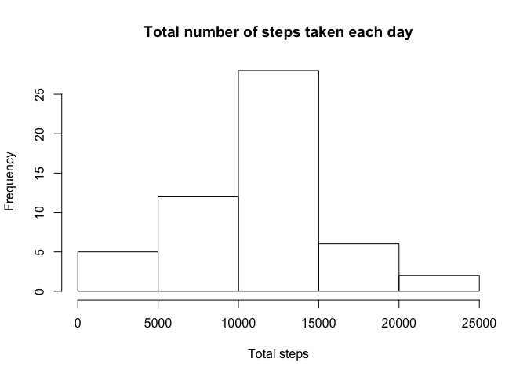
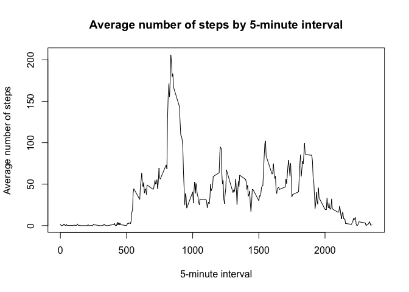
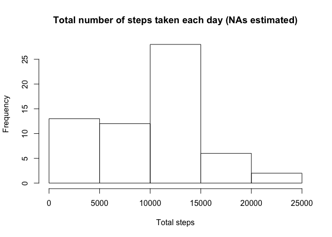
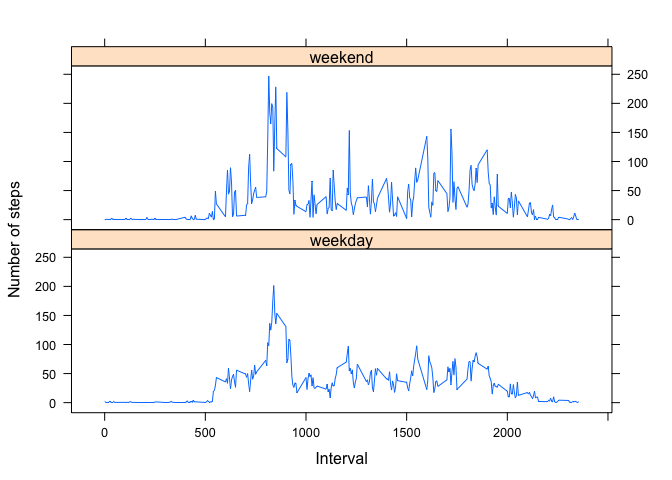

# Reproducible Research: Peer Assessment 1


## Loading and preprocessing the data

```r
#Load data
activity <- read.csv("activity.csv")

# Transform loaded dates into R date format
activity$date <- as.Date(activity$date)

# Transform data frame into dplyr package format
library(dplyr)
```

```
## 
## Attaching package: 'dplyr'
## 
## The following objects are masked from 'package:stats':
## 
##     filter, lag
## 
## The following objects are masked from 'package:base':
## 
##     intersect, setdiff, setequal, union
```

```r
activity <- tbl_df(activity)
```


## What is mean total number of steps taken per day?

```r
# Histogram of the total number of steps taken each day
steps_byday <- activity %>% 
                filter(!is.na(steps)) %>% 
                group_by(date) %>% 
                summarize(total = sum(steps))

hist(steps_byday$total
     , main = "Total number of steps taken each day"
     , xlab = "Total steps"
     )
```

 

```r
# Calculate and report the mean and median total number of steps taken per day
mean(steps_byday$total)
```

```
## [1] 10766.19
```

```r
median(steps_byday$total)
```

```
## [1] 10765
```


## What is the average daily activity pattern?

```r
# Plot of the 5-minute interval (x-axis) and the average number of steps taken, averaged across all days (y-axis)

stepstaken5min <- activity %>% 
                filter(!is.na(steps)) %>% 
                group_by(interval) %>% 
                summarize(avg = mean(steps)) %>%
                arrange(interval)
                
with(stepstaken5min, 
     plot(x = interval
     , y = avg
     , type = 'l'
     , main = "Average number of steps by 5-minute interval"
     , ylab = "Average number of steps"
     , xlab = "5-minute interval"
     )
)
```

 

```r
# 5-minute interval, on average across all the days in the dataset, that contains the maximum number of steps

maxavg <- stepstaken5min %>% arrange(desc(avg))
maxavg$interval[1]
```

```
## [1] 835
```


## Imputing missing values


```r
# Calculate and report the total number of missing values in the dataset (i.e. the total number of rows with `NA`s)
sum(is.na(activity$steps))
```

```
## [1] 2304
```
The total number of missig values in the original activity database is 2304.

The selected strategy for filling the missing values in the dataset is to use the mean for that day. If there is no value for the day, the value is filled with the interval mean.


```r
# Create a new dataset that is equal to the original dataset but with the missing data filled in.

activitytidy <- activity
for (i in 1:nrow(activitytidy)) {
  if (is.na(activitytidy$steps[i])) {
    date_i <- activitytidy$date[i]
    activity_day <- activitytidy %>% filter(date == date_i)
    avg <- mean(activity_day$steps, na.rm = TRUE)
    if(is.nan(avg)) {
      interval_i <- activitytidy$interval[i]
      activity_interval <- activitytidy %>% filter(interval == interval_i)
      avg <- mean(activity_interval$steps, na.rm = TRUE)
    }
    activitytidy$steps[i] <- avg
  }
}


# Make a histogram of the total number of steps taken each day and Calculate and report the **mean** and **median** total number of steps taken per day. Do these values differ from the estimates from the first part of the assignment? What is the impact of imputing missing data on the estimates of the total daily number of steps?

# Histogram of the total number of steps taken each day
steps_byday_tidy <- activitytidy %>% 
                group_by(date) %>% 
                summarize(total = sum(steps))

hist(steps_byday_tidy$total
     , main = "Total number of steps taken each day (NAs estimated)"
     , xlab = "Total steps"
     )
```

 

```r
# Calculate and report the mean and median total number of steps taken per day
mean(steps_byday_tidy$total)
```

```
## [1] 9419.081
```

```r
median(steps_byday_tidy$total)
```

```
## [1] 10395
```


The impact of imputing missing data is to underestimte the mean on 1347.1079493 and the median on 370.

## Are there differences in activity patterns between weekdays and weekends?

```r
#Use the dataset with the filled-in missing values for this part.
# Create a new factor variable in the dataset with two levels -- "weekday" and "weekend" indicating whether a given date is a weekday or weekend day.
activitytidy$daygroup <- sapply(steps_byday_tidy$date
                                    , function(x) 
                                      if (weekdays(x) %in% c("Sábado", "Domingo")) {
                                           "weekend"} else "weekday")
activitytidy$daygroup <- as.factor(activitytidy$daygroup)

# Make a panel plot containing a time series plot (i.e. `type = "l"`) of the 5-minute interval (x-axis) and the average number of steps taken, averaged across all weekday days or weekend days (y-axis). The plot should look something like the following, which was created using **simulated data**:
activitybydaygroup <- activitytidy %>% 
                        select(steps, interval, daygroup) %>% 
                        group_by(daygroup, interval) %>% 
                        summarize(steps = mean(steps))
library(lattice)
xyplot(steps ~ interval | daygroup
       , data = activitybydaygroup
       , type = "l"
       , layout = c(1, 2)
       , xlab = "Interval"
       , ylab = "Number of steps")
```

 

